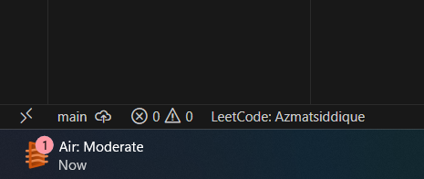

# LeetCode

Solve LeetCode problems in VS Code

## Requirements

- [VS Code 1.30.1+](https://code.visualstudio.com/)
- [Node.js 8+](https://nodejs.org)

> NOTE: Please make sure that `Node` is in your `PATH` environment variable. You can also use the setting `leetcode.nodePath` to specify the location of your `Node.js` executable.

## Quick Start

## Features

### Sign In/Out

#### Sign in

  

Simply click `Sign in to LeetCode` in the `LeetCode Explorer` will let you **sign in** with your LeetCode account.

You can also use the following command to sign in/out:
- **LeetCode: Sign in**
- **LeetCode: Sign out**

---

### Pick a Problem

#### Pick a Problem

  

Directly click on the problem or right click the problem in the `LeetCode Explorer` and select `Preview Problem` to see the problem description.

Select `Show Problem` to directly open the file with the problem description.

> Note：You can specify the path of the workspace folder to store the problem files by updating the setting `leetcode.workspaceFolder`. The default value is：**$HOME/.leetcode/**.

> You can specify whether including the problem description in comments or not by updating the setting `leetcode.showCommentDescription`.

> You can switch the default language by triggering the command: `LeetCode: Switch Default Language`.

---

### Editor Shortcuts

#### Editor Shortcuts

  

The extension supports 4 editor shortcuts (aka Code Lens):

- `Submit`: Submit your answer to LeetCode.
- `Test`: Test your answer with customized test cases.
- `Solution`: Show the top voted solution for the current problem.
- `Description`: Show the problem description page.

> Note: You can customize the shortcuts using the setting: `leetcode.editor.shortcuts`. By default, only `Submit` and `Test` shortcuts are enabled.

---

### Search problems by Keywords

#### Search problems by Keywords

  

By clicking the button  at the **explorer's navigation bar**, you can search the problems by keywords.

---

### Manage Session

#### Manage Session

  

To manage your LeetCode sessions, just clicking the `LeetCode: ***` at the bottom of the status bar. You can **switch** between sessions or **create**, **delete** a session.

---

## Settings

| Setting Name | Description | Default Value |
| --- | --- | --- |
| `leetcode.hideSolved` | Specify to hide the solved problems or not | `false` |
| `leetcode.showLocked` | Specify to show the locked problems or not. Only Premium users could open the locked problems | `false` |
| `leetcode.defaultLanguage` | Specify the default language used to solve the problem. Supported languages are: `bash`, `c`, `cpp`, `csharp`, `golang`, `java`, `javascript`, `kotlin`, `mysql`, `php`, `python`, `python3`, `ruby`, `rust`, `scala`, `swift` | `N/A` |
| `leetcode.useWsl` | Specify whether to use WSL or not | `false` |
| `leetcode.endpoint` | Specify the active endpoint. Supported endpoints are: `leetcode` | `leetcode` |
| `leetcode.workspaceFolder` | Specify the path of the workspace folder to store the problem files. | `""` |
| `leetcode.filePath` | Specify the relative path under the workspace and the file name to save the problem files. More details can be found [here](https://github.com/LeetCode-OpenSource/vscode-leetcode/wiki/Customize-the-Relative-Folder-and-the-File-Name-of-the-Problem-File). | |
| `leetcode.enableStatusBar` | Specify whether the LeetCode status bar will be shown or not. | `true` |
| `leetcode.editor.shortcuts` | Specify the customized shorcuts in editors. Supported values are: `submit`, `test`, `solution` and `description`. | `["submit, test"]` |
| `leetcode.enableSideMode` | Specify whether `preview`, `solution` and `submission` tab should be grouped into the second editor column when solving a problem. | `true` |
| `leetcode.nodePath` | Specify the `Node.js` executable path. for example, `C:\Program Files\nodejs\node.exe` | `node` |
| `leetcode.showCommentDescription` | Specify whether to include the problem description in the comments | `false` |

## Want Help?

When you meet any problem, you can check out the [Troubleshooting](https://github.com/LeetCode-OpenSource/vscode-leetcode/wiki/Troubleshooting) and [FAQ](https://github.com/LeetCode-OpenSource/vscode-leetcode/wiki/FAQ) first.

If your problem still cannot be addressed, feel free to reach us in the [Gitter Channel](https://gitter.im/vscode-leetcode/Lobby) or [file an issue](https://github.com/LeetCode-OpenSource/vscode-leetcode/issues/new/choose).

